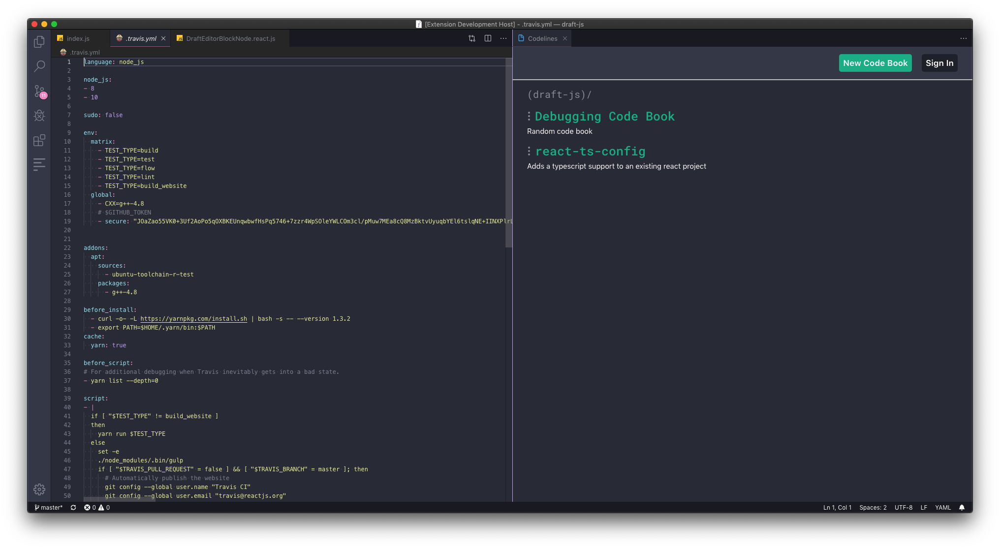
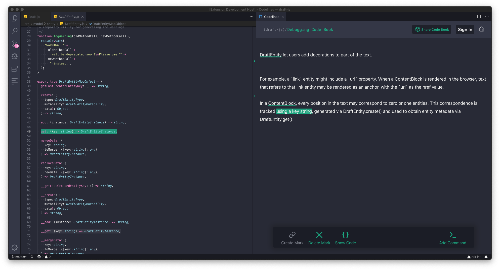
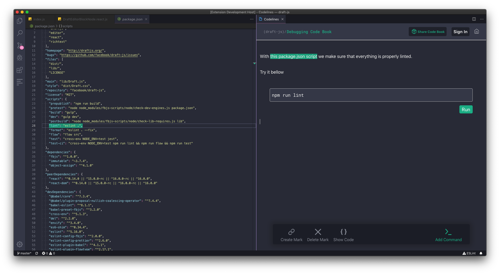

# Codelines

[Codelines](https://codelines.dev) lets you share programming knowledge as interactive walkthroughs. Stop reading annoying tutorials on Internet.

## Create & read inside your IDE

Create Code Books inside your code editor to create interactive code walkthroughs.
Code Books are bundled full projects that can be executed and debugged.

## Connect code to text

Use marks to bind code with text.
Marks automatically update when code and text is changed.

## Interactive walkthroughs

Add terminal commands into Code Books and interact with your workspace.

