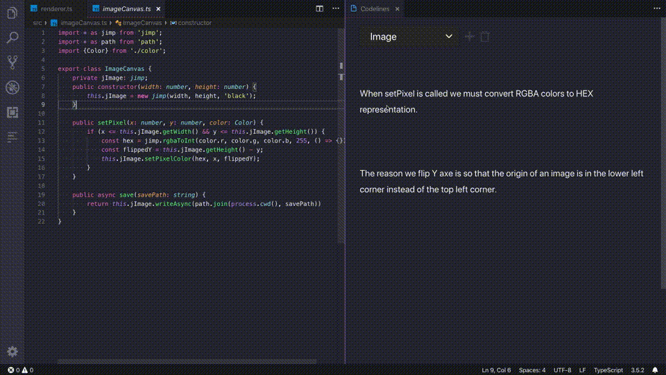
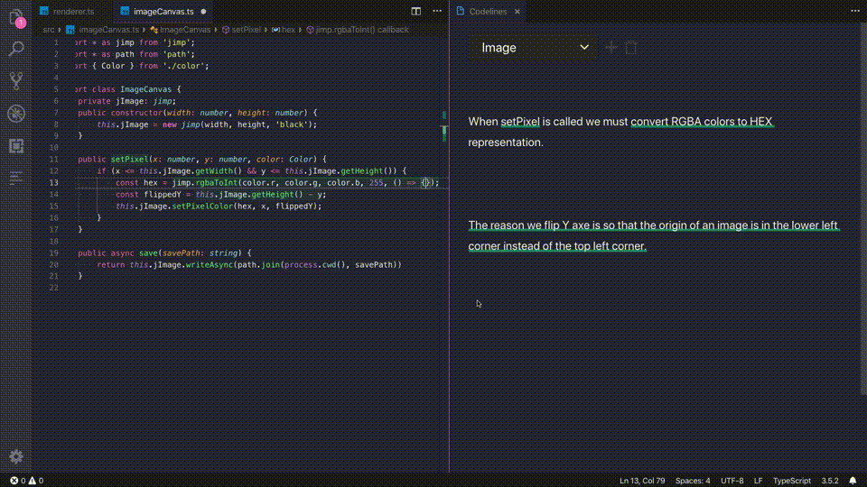
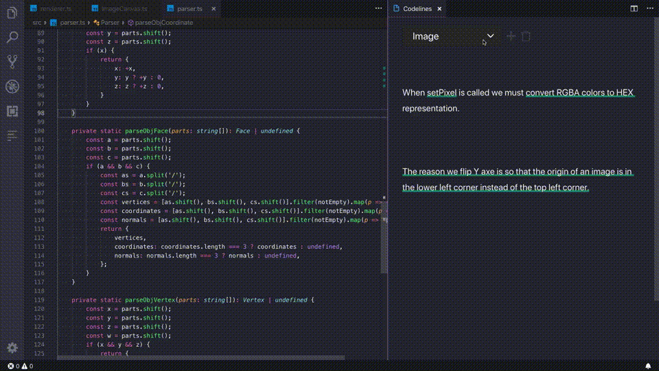

# Codelines

[Codelines](https://codelines.dev) let connect your code with richt text. User marks to create bindings between the code and the text.
 
[Join Our Community](https://join.slack.com/t/codelinescommunity/shared_invite/enQtNzE3NDE1Njc5NDEzLWIxNzA3YWIyNjU0ZmNmOGFhNGZkZDJjNTgyNjc0NTI2YjgyMWY3NzEyZGFmNGIzY2E1ZWE2MmM4NmQ5ZDQ3MWU)

## Annotate Code With Marks

Use marks to create bindings between the code and the text.

## Edit Marks

Codelines keep references between the marks you created.
Every time you update your code, the marks get updated.

## Group Related Parts

Create multiple documents in the editor, one for each logical part.

